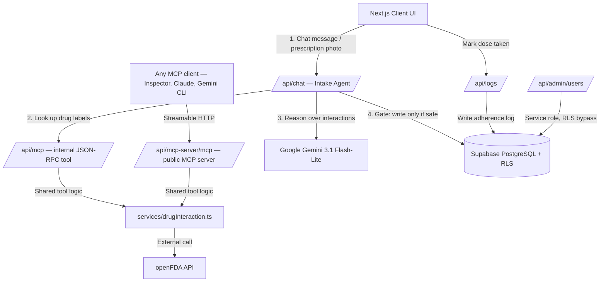

# 📋 MediMate AI — Smart Medication Reminder & Personal Health Agent

> **🌐 Live demo:** **https://medimate-ai-five.vercel.app/**
> **🏆 Kaggle Vibe Coding Capstone — Track: Concierge Agents**
> **🇻🇳 Bản tiếng Việt:** [README.vi.md](README.vi.md)


MediMate AI is a personal health agent that helps patients — especially the elderly and people managing chronic conditions — **remember their medications, track treatment adherence, and automatically screen for dangerous drug interactions** using official drug-label data from **openFDA**.

Users interact in natural Vietnamese (or English) through a chat interface, or simply **snap a photo of a prescription** — the agent reasons over the messy input, extracts structured medication data, checks it for cross-interactions against the drugs the patient is already taking, and only then schedules the doses.

---

## ✨ Key Features

| # | Feature | Description |
|---|---------|-------------|
| 1 | **Conversational Health Agent** | Natural-language chat (Vietnamese/English). The agent reasons over unstructured input and proactively asks follow-up questions when critical info (dosage, timing) is missing before saving anything. |
| 2 | **Drug-Interaction Screening (MCP server + openFDA)** | The `check_drug_interaction` tool queries openFDA and warns about dangerous cross-interactions **before** a new medication is scheduled. It is exposed both as a **spec-compliant MCP server** (`/api/mcp-server/mcp`, Streamable HTTP — connect with any MCP client) and as the internal authenticated JSON-RPC 2.0 endpoint the agent pipeline calls. |
| 3 | **Prescription OCR** | Snap or upload a photo of a prescription; the agent extracts drug name, dosage, frequency and schedule, then auto-creates the reminders. |
| 4 | **Adherence Streak Tracking** | Computes the patient's real adherence streak — a day counts as "on track" only when ≥80% of that day's scheduled doses were actually taken. |
| 5 | **Admin Portal** | System-wide stats (users, total medications, overall adherence), per-patient drill-down, and an emergency **System Broadcast**. Access is gated server-side by an `ADMIN_EMAILS` allowlist. |

---

## 🏛️ Architecture

MediMate AI follows a **fail-safe agentic pipeline**: the intake agent extracts data, a tool endpoint fetches external drug labels, an interaction checker reasons over them, and a **gate** blocks the database write when an unverified/high-risk interaction is detected.



See [architecture.md](architecture.md) for the full data model, adherence-streak algorithm, and security design (Vietnamese: [architecture.vi.md](architecture.vi.md)).

### Course concepts demonstrated

| Concept | Where |
|---------|-------|
| **Agentic pipeline** (Intake Agent → tool → Interaction Checker → safe-write gate) | `src/app/api/chat/route.ts` |
| **MCP server** (Model Context Protocol, Streamable HTTP via `@modelcontextprotocol/sdk` + `mcp-handler`) + internal JSON-RPC 2.0 transport | `src/app/api/mcp-server/[transport]/route.ts`, `src/app/api/mcp/route.ts`, shared logic in `src/services/drugInteraction.ts` |
| **Security features** (auth on every route, tightened RLS, DoS limits, no PHI in logs, fail-safe write gate) | `src/app/api/**`, `supabase/migrations/` |
| **Deployability** | Live on Vercel — https://medimate-ai-five.vercel.app/ |
| **Agent skills / CLI** (Gemini CLI context + custom commands: `/safety:audit`, `/db:schema`, `/tool:check`) | `GEMINI.md`, `.gemini/commands/`, `AGENTS.md` |

#### Try the MCP server yourself

```bash
npx @modelcontextprotocol/inspector
# → connect to: https://medimate-ai-five.vercel.app/api/mcp-server/mcp (Streamable HTTP)
# → call tool: check_drug_interaction  { "drugs": ["warfarin", "aspirin"] }
```

The public MCP endpoint handles **no patient data** — it only proxies public openFDA drug labels, with schema-enforced DoS caps (≤ 10 drugs, names ≤ 100 chars).

---

## 🛠️ Tech Stack

| Layer | Technology |
|-------|-----------|
| Frontend / Backend | Next.js 16 (App Router), React 19, TailwindCSS v4 |
| Database | Supabase (PostgreSQL) with tightened Row Level Security |
| AI / LLM | `@google/genai` — default model `gemini-3.1-flash-lite` (override via `GEMINI_MODEL`) for NLU extraction, OCR and conversation |
| Tool protocol | `@modelcontextprotocol/sdk` + `mcp-handler` — public MCP server (Streamable HTTP) |
| External API | openFDA (U.S. Food and Drug Administration) |
| Hosting | Vercel |

---

## 📁 Project Structure

```
├── public/                 # App images & icons (incl. cover_image.png)
├── src/
│   ├── app/
│   │   ├── api/
│   │   │   ├── admin/       # Admin: stats, patient directory, user create/delete
│   │   │   ├── broadcast/   # System broadcast publish/read
│   │   │   ├── chat/        # Conversational agent, OCR, scheduling (intake + gate)
│   │   │   ├── logs/        # Read/update dose-taken status
│   │   │   ├── mcp/         # Internal JSON-RPC tool endpoint (authenticated)
│   │   │   ├── mcp-server/  # Public MCP server (Streamable HTTP, spec-compliant)
│   │   │   ├── medications/ # Patient medication CRUD
│   │   │   └── stats/       # Adherence-streak computation
│   │   ├── globals.css      # Theme & color tokens
│   │   ├── layout.tsx       # Root layout
│   │   └── page.tsx         # Main dashboard + AI chat window
│   ├── components/          # Shared UI: Chrome (header/nav/auth), Modals, types
│   ├── services/
│   │   ├── drugInteraction.ts   # Shared openFDA tool logic (both MCP transports)
│   │   └── medicationService.ts # Medication CRUD + adherence-streak logic
│   └── utils/
│       ├── apiError.ts      # Standardized error responses (hide sensitive detail)
│       └── supabase/        # Supabase client factories (build-safe)
├── supabase/
│   ├── migrations/          # Tables, RLS policies, triggers (00 → 07)
│   └── schema.sql           # Full consolidated schema
├── .gemini/commands/        # Gemini CLI agent skills (/safety:audit, /db:schema, /tool:check)
├── GEMINI.md                # Gemini CLI context file (agent rules for this repo)
├── AGENTS.md                # Vendor-neutral agent instructions
└── .env.example             # Environment variable template
```

---

## ⚙️ Environment Variables

Create a `.env.local` in the project root:

```env
# Supabase
NEXT_PUBLIC_SUPABASE_URL=your_supabase_url_here
NEXT_PUBLIC_SUPABASE_ANON_KEY=your_supabase_anon_key_here
SUPABASE_SERVICE_ROLE_KEY=your_supabase_service_role_key_here

# Google Gemini
GEMINI_API_KEY=your_gemini_api_key_here
# Optional: override the model in one place (verify it exists in your account).
# GEMINI_MODEL=gemini-3.1-flash-lite

# Admin allowlist — comma-separated emails granted Admin Portal access (server-side, not spoofable).
ADMIN_EMAILS=admin@medimate.ai
```

| Variable | Required | Purpose |
|----------|----------|---------|
| `NEXT_PUBLIC_SUPABASE_URL` / `NEXT_PUBLIC_SUPABASE_ANON_KEY` | ✅ | Client & server Supabase access |
| `SUPABASE_SERVICE_ROLE_KEY` | ✅ (for Admin) | Admin stats, patient directory, user CRUD, broadcast. Without it the Admin Portal shows an honest empty state (no fake data). |
| `GEMINI_API_KEY` | ✅ | Gemini access for NLU/OCR/chat |
| `GEMINI_MODEL` | ⬜ | Override the default `gemini-3.1-flash-lite` |
| `ADMIN_EMAILS` | ✅ (for Admin) | Server-side allowlist deciding who reaches the Admin Portal (cannot be spoofed) |

---

## 🚀 Setup & Run

### 1. Install dependencies
```bash
npm install
```
> Node **≥ 22** is recommended (the Supabase v2.110 SDK targets Node 22). On Vercel, set Project → Settings → **Node.js version to 22.x**.

### 2. Set up the database
In the Supabase Dashboard SQL editor, either run the migrations in `supabase/migrations/` **in order (`00` → `07`)**, or run the consolidated `supabase/schema.sql` directly.

### 3. Run in development
```bash
npm run dev
```
Open [http://localhost:3000](http://localhost:3000).

### 4. Production build
```bash
npm run build
```

### 5. Deploy to Vercel
Import the GitHub repo into Vercel, set all environment variables above, set the Node.js version to **22.x**, and deploy. Live instance: **https://medimate-ai-five.vercel.app/**

---

## 👥 Demo Accounts (1-Click Login)

Two demo accounts are pre-seeded so judges can try the app without registering. Use the **Login as Admin** / **Login as User** buttons on the sign-in screen to auto-fill credentials:

| Role | Email | Password | Access |
|------|-------|----------|--------|
| **Admin** | `admin@medimate.ai` | `admin123456` | Admin Portal — system stats, patient directory, emergency broadcast |
| **Patient** | `user@medimate.ai` | `user123456` | Personal medication management, scheduling, AI agent with prescription OCR |

---

## 🔒 Security & RLS

MediMate AI applies HIPAA-inspired safeguards:

- **Authentication on every user-facing API route** via Supabase JWT session cookies.
- **Tightened RLS on `medication_logs`**: the `INSERT` policy verifies ownership of *both* the log's `user_id` **and** the referenced `medication_id`'s owner, preventing cross-account log injection:
  ```sql
  WITH CHECK (
      auth.uid() = user_id
      AND EXISTS (
          SELECT 1 FROM public.medications
          WHERE id = medication_id AND user_id = auth.uid()
      )
  )
  ```
- **No PHI in logs** — patient medical data is never written to server console logs.
- **DoS limits** on both tool transports — max 10 drugs per interaction check and drug names capped at 100 characters (single source of truth in `src/services/drugInteraction.ts`).
- **Scoped anonymous surface** — the public MCP server (`/api/mcp-server/mcp`) is the only unauthenticated route, and it serves **only public openFDA data**, never patient data; the internal `/api/mcp` transport still requires a Supabase session.
- **Fail-safe interaction gate** — a genuine HIGH/MEDIUM interaction blocks the write and requires explicit confirmation; a drug openFDA can't verify is saved but flagged as unverified (with advice to consult a professional) rather than silently recorded as "safe".
- **Server-side admin allowlist** — Admin access is decided by `ADMIN_EMAILS` on the server and cannot be spoofed from the client.

---

## 📄 License

Released under the [MIT License](LICENSE).
