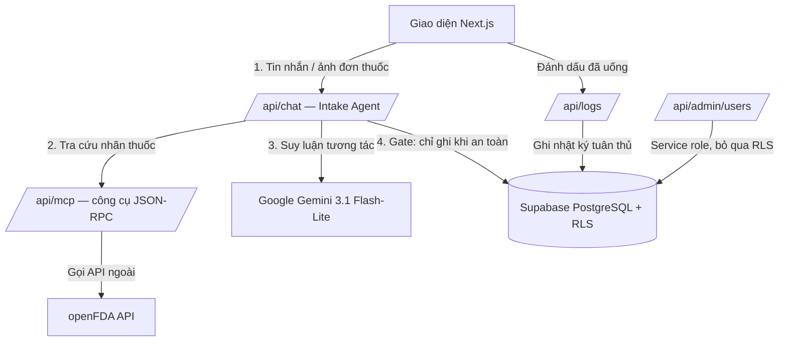

# 📋 MediMate AI — Trợ lý Nhắc lịch Uống thuốc & Sức khỏe Cá nhân thông minh

> **🌐 Bản demo trực tuyến:** **https://medimate-ai-five.vercel.app/**
> **🏆 Kaggle Vibe Coding Capstone — Track: Concierge Agents**
> **🇬🇧 English version:** [README.md](README.md)


MediMate AI là một trợ lý y tế cá nhân giúp bệnh nhân — đặc biệt là người cao tuổi và người mắc bệnh mạn tính — **ghi nhớ lịch uống thuốc, theo dõi mức độ tuân thủ điều trị, và tự động kiểm tra các tương tác thuốc nguy hiểm** dựa trên dữ liệu nhãn thuốc chính thức từ **openFDA**.

Người dùng tương tác bằng ngôn ngữ tự nhiên (tiếng Việt hoặc tiếng Anh) qua giao diện chat, hoặc chỉ cần **chụp ảnh đơn thuốc** — agent sẽ suy luận trên nội dung lộn xộn, trích xuất dữ liệu thuốc có cấu trúc, kiểm tra tương tác chéo với các thuốc bệnh nhân đang dùng, rồi mới lên lịch uống.

---

## ✨ Tính năng chính

| # | Tính năng | Mô tả |
|---|-----------|-------|
| 1 | **Trợ lý sức khỏe hội thoại** | Chat ngôn ngữ tự nhiên (Việt/Anh). Agent suy luận trên nội dung phi cấu trúc và chủ động hỏi lại khi thiếu thông tin quan trọng (liều lượng, thời gian) trước khi lưu bất cứ gì. |
| 2 | **Kiểm tra tương tác thuốc (JSON-RPC theo mô hình MCP + openFDA)** | Một endpoint công cụ JSON-RPC 2.0 nội bộ (thiết kế theo Model Context Protocol — `tools/list`, `tools/call`) tra cứu openFDA và cảnh báo tương tác chéo nguy hiểm **trước khi** thêm thuốc mới vào lịch. |
| 3 | **Đọc đơn thuốc bằng ảnh (OCR)** | Chụp hoặc tải ảnh đơn thuốc; agent trích xuất tên thuốc, liều lượng, tần suất và lịch uống, rồi tự động tạo nhắc nhở. |
| 4 | **Theo dõi chuỗi ngày tuân thủ (Adherence Streak)** | Tính chuỗi ngày tuân thủ thực tế — một ngày chỉ được tính là "đạt" khi ≥ 80% số lượt uống trong ngày được thực hiện. |
| 5 | **Phân hệ Quản trị (Admin Portal)** | Thống kê toàn hệ thống (người dùng, tổng số thuốc, tỷ lệ tuân thủ), xem chi tiết từng bệnh nhân, và **phát thông báo khẩn cấp toàn hệ thống (System Broadcast)**. Quyền truy cập được kiểm soát phía máy chủ qua allowlist `ADMIN_EMAILS`. |

---

## 🏛️ Kiến trúc

MediMate AI vận hành theo mô hình **agentic pipeline có kiểm soát an toàn (fail-safe)**: agent tiếp nhận trích xuất dữ liệu, một endpoint công cụ tra cứu nhãn thuốc bên ngoài, bộ kiểm tra tương tác suy luận trên đó, và một **cổng chặn (gate)** sẽ ngăn ghi vào cơ sở dữ liệu khi phát hiện tương tác chưa được xác minh hoặc rủi ro cao.



Xem [architecture.vi.md](architecture.vi.md) để biết chi tiết mô hình dữ liệu, thuật toán tính chuỗi tuân thủ và thiết kế bảo mật.

### Các khái niệm của khóa học được thể hiện

| Khái niệm | Ở đâu |
|-----------|-------|
| **Agentic pipeline** (Intake Agent → công cụ → Interaction Checker → cổng ghi an toàn) | `src/app/api/chat/route.ts` |
| **Công cụ theo mô hình MCP** (JSON-RPC 2.0 `tools/list` / `tools/call` trên openFDA) | `src/app/api/mcp/route.ts` |
| **Tính năng bảo mật** (xác thực mọi route, RLS thắt chặt, giới hạn chống DoS, không log PHI, cổng ghi fail-safe) | `src/app/api/**`, `supabase/migrations/` |
| **Khả năng triển khai (Deployability)** | Chạy trực tuyến trên Vercel — https://medimate-ai-five.vercel.app/ |

---

## 🛠️ Công nghệ sử dụng

| Lớp | Công nghệ |
|-----|-----------|
| Frontend / Backend | Next.js 16 (App Router), React 19, TailwindCSS v4 |
| Cơ sở dữ liệu | Supabase (PostgreSQL) với Row Level Security thắt chặt |
| AI / LLM | `@google/genai` — mặc định dùng `gemini-3.1-flash-lite` (đổi qua `GEMINI_MODEL`) cho NLU, OCR và hội thoại |
| API ngoài | openFDA (Cục Quản lý Thực phẩm và Dược phẩm Hoa Kỳ) |
| Hosting | Vercel |

---

## 📁 Cấu trúc dự án

```
├── public/                 # Ảnh, biểu tượng (gồm cover_image.png)
├── src/
│   ├── app/
│   │   ├── api/
│   │   │   ├── admin/       # Quản trị: thống kê, danh sách bệnh nhân, tạo/xoá user
│   │   │   ├── broadcast/   # Phát/đọc thông báo hệ thống
│   │   │   ├── chat/        # Agent hội thoại, OCR, lên lịch (intake + gate)
│   │   │   ├── logs/        # Đọc/cập nhật trạng thái đã uống
│   │   │   ├── mcp/         # Endpoint công cụ JSON-RPC (theo mô hình MCP) → openFDA
│   │   │   ├── medications/ # CRUD đơn thuốc của bệnh nhân
│   │   │   └── stats/       # Tính chuỗi ngày tuân thủ
│   │   ├── globals.css      # Theme & token màu sắc
│   │   ├── layout.tsx       # Layout gốc
│   │   └── page.tsx         # Dashboard chính + cửa sổ chat AI
│   ├── components/          # UI dùng chung: Chrome (header/nav/auth), Modals, types
│   ├── services/
│   │   └── medicationService.ts # CRUD thuốc + logic chuỗi tuân thủ
│   └── utils/
│       ├── apiError.ts      # Chuẩn hoá phản hồi lỗi (ẩn chi tiết nhạy cảm)
│       └── supabase/        # Khởi tạo Supabase client (an toàn khi build)
├── supabase/
│   ├── migrations/          # Bảng, chính sách RLS, trigger (00 → 07)
│   └── schema.sql           # Lược đồ hợp nhất đầy đủ
└── .env.example             # Biểu mẫu biến môi trường
```

---

## ⚙️ Biến môi trường

Tạo file `.env.local` ở thư mục gốc:

```env
# Supabase
NEXT_PUBLIC_SUPABASE_URL=your_supabase_url_here
NEXT_PUBLIC_SUPABASE_ANON_KEY=your_supabase_anon_key_here
SUPABASE_SERVICE_ROLE_KEY=your_supabase_service_role_key_here

# Google Gemini
GEMINI_API_KEY=your_gemini_api_key_here
# Tùy chọn: đổi model ở một chỗ duy nhất (kiểm tra model tồn tại trong tài khoản của bạn).
# Mặc định là gemini-3.1-flash-lite.
# GEMINI_MODEL=gemini-3.1-flash-lite

# Allowlist admin — danh sách email (phân tách bằng dấu phẩy) được vào Admin Portal (kiểm tra phía server, không giả mạo được).
ADMIN_EMAILS=admin@medimate.ai
```

| Biến | Bắt buộc | Mục đích |
|------|----------|----------|
| `NEXT_PUBLIC_SUPABASE_URL` / `NEXT_PUBLIC_SUPABASE_ANON_KEY` | ✅ | Truy cập Supabase phía client & server |
| `SUPABASE_SERVICE_ROLE_KEY` | ✅ (cho Admin) | Thống kê, danh sách bệnh nhân, CRUD user, broadcast. Thiếu khóa này thì Admin Portal hiển thị trạng thái trống trung thực (không tạo dữ liệu giả). |
| `GEMINI_API_KEY` | ✅ | Truy cập Gemini cho NLU/OCR/chat |
| `GEMINI_MODEL` | ⬜ | Ghi đè model mặc định `gemini-3.1-flash-lite` |
| `ADMIN_EMAILS` | ✅ (cho Admin) | Allowlist phía server quyết định ai vào được Admin Portal (không thể giả mạo) |

---

## 🚀 Cài đặt & Chạy thử

### 1. Cài dependencies
```bash
npm install
```
> Khuyến nghị Node **≥ 22** (SDK Supabase v2.110 nhắm tới Node 22). Trên Vercel, đặt Project → Settings → **Node.js version = 22.x**.

### 2. Thiết lập cơ sở dữ liệu
Trong SQL editor của Supabase Dashboard, chạy các migration trong `supabase/migrations/` **theo thứ tự (`00` → `07`)**, hoặc chạy trực tiếp file hợp nhất `supabase/schema.sql`.

### 3. Chạy chế độ phát triển
```bash
npm run dev
```
Mở [http://localhost:3000](http://localhost:3000).

### 4. Build production
```bash
npm run build
```

### 5. Triển khai lên Vercel
Import repo GitHub vào Vercel, thiết lập đầy đủ biến môi trường ở trên, đặt Node.js version **22.x** và deploy. Bản chạy trực tuyến: **https://medimate-ai-five.vercel.app/**

---

## 👥 Tài khoản Demo (Đăng nhập 1-chạm)

Hai tài khoản demo được tạo sẵn để giám khảo dùng thử mà không cần đăng ký. Bấm nút **Đăng nhập Admin** / **Đăng nhập User** ở màn hình đăng nhập để tự điền thông tin:

| Vai trò | Email | Mật khẩu | Quyền |
|---------|-------|----------|-------|
| **Admin** | `admin@medimate.ai` | `admin123456` | Admin Portal — thống kê hệ thống, danh sách bệnh nhân, phát thông báo khẩn cấp |
| **Bệnh nhân** | `user@medimate.ai` | `user123456` | Quản lý thuốc cá nhân, đặt lịch, AI agent với OCR đơn thuốc |

---

## 🔒 Bảo mật & RLS

MediMate AI áp dụng các biện pháp lấy cảm hứng từ HIPAA:

- **Xác thực trên mọi API route phục vụ người dùng** qua Supabase JWT session cookie.
- **RLS thắt chặt trên `medication_logs`**: chính sách `INSERT` kiểm tra quyền sở hữu của *cả* `user_id` của log **lẫn** chủ sở hữu của `medication_id` được tham chiếu, ngăn chèn log chéo tài khoản:
  ```sql
  WITH CHECK (
      auth.uid() = user_id
      AND EXISTS (
          SELECT 1 FROM public.medications
          WHERE id = medication_id AND user_id = auth.uid()
      )
  )
  ```
- **Không log PHI** — dữ liệu y tế của bệnh nhân không bao giờ được ghi ra console log máy chủ.
- **Giới hạn chống DoS** trên endpoint MCP — tối đa 10 thuốc mỗi lượt kiểm tra tương tác, tên thuốc giới hạn 100 ký tự.
- **Cổng kiểm tra tương tác fail-safe** — nếu việc kiểm tra lỗi hoặc không parse được, agent cảnh báo người dùng thay vì âm thầm lưu thuốc như thể "an toàn".
- **Allowlist admin phía server** — quyền admin do `ADMIN_EMAILS` quyết định ở phía server, không thể giả mạo từ client.
