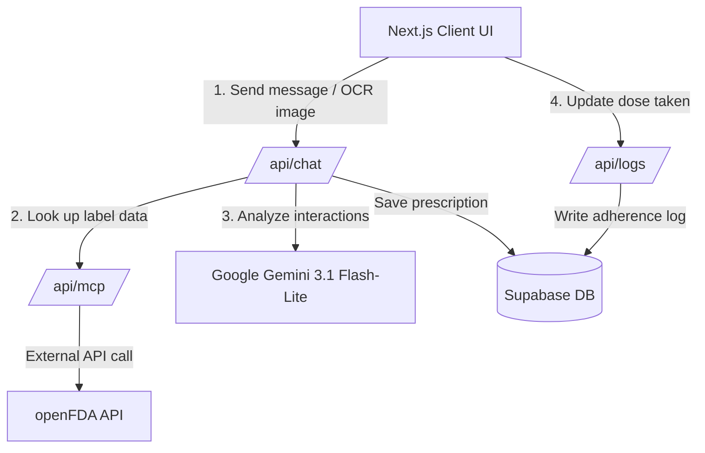

# 🏛️ System Architecture — MediMate AI

> 🇻🇳 Bản tiếng Việt: [architecture.vi.md](architecture.vi.md)

This document describes the software architecture, data model, core business flows (the intake/interaction-checking flow and the adherence calculation), and the medical-data security mechanisms of MediMate AI.

---

## 1. Architecture Overview

MediMate AI is built on the **Next.js App Router** combined with a **Backend-as-a-Service (Supabase) database security** model. All business logic is packaged as serverless API routes protected by the Supabase Auth middleware layer.



---

## 2. Core Business Flows

### A. Add Medication & Interaction Check (Intake & Safe Interaction Checker)

When a user submits a request to add a new medication (via chat text or a prescription photo):

1. **Intake Agent**: Gemini extracts the medication fields (`name`, `dosage`, `frequency`, `schedule`, `total_stock`, `dosage_quantity`).
2. **Retrieve Current Drugs**: The system loads the patient's currently-taken medications from Supabase.
3. **MCP Query**:
   - The `/api/chat` route makes an internal POST call to the MCP-style tool endpoint `/api/mcp`.
   - That endpoint uses `AbortSignal.timeout(8000)` to query interaction data from the U.S. openFDA API.
4. **Interaction Checker Agent**:
   - Receives the raw label report from the tool endpoint.
   - Uses Gemini to analyze cross-interaction warnings between the new medication and the existing ones.
   - If a **High** or **Medium** risk interaction is detected, the system halts and returns a `WARNING_INTERACTION` response with guidance. The patient can cancel, or explicitly accept the risk to record the schedule.

### B. Adherence Streak Calculation

The real adherence rate is computed automatically via the `/api/stats` route and the `getComplianceStreak()` method:

- Scan all medication logs from the last 30 days.
- Group them by day (`YYYY-MM-DD` format).
- A day counts as **on track** when the ratio of doses actually taken (status `taken`) to the total doses scheduled that day is **≥ 80%**.
- The streak counts backwards from today (or from yesterday if today's doses aren't due yet, or if the day still has pending doses that keep the day from being decided).

---

## 3. Medical-Data Security Policy (HIPAA-inspired)

To protect personal health information, MediMate AI applies the following measures:

1. **Row Level Security (RLS) at the database level**:
   - The `medications` table only allows CRUD by the owner (`auth.uid() = user_id`).
   - The `medication_logs` table uses a tightened RLS `INSERT` policy that prevents cross-assigning a log to another user's medication:
     ```sql
     WITH CHECK (
         auth.uid() = user_id
         AND EXISTS (
             SELECT 1 FROM public.medications
             WHERE id = medication_id AND user_id = auth.uid()
         )
     )
     ```
2. **Protecting the MCP tool endpoint**:
   - `/api/mcp` requires an authenticated user via the Supabase Auth session cookie forwarded from `/api/chat`. Anonymous external access is fully blocked.
3. **No PHI leakage**:
   - Patient medical data is never written to server console logs (e.g. no `console.log` of prescription data or dose-log details).

---

## 4. Admin Panel Layout & RBAC

Access control is based on an **email allowlist** configured via the `ADMIN_EMAILS` environment variable and checked entirely server-side (it cannot be spoofed from the client).

- **Admin API (`/api/admin/users`)**: Instantiates a Supabase client with the `SUPABASE_SERVICE_ROLE_KEY` to bypass RLS, gather system-wide statistics, and list users along with their real adherence streaks.
- **Honest empty state**: If the server has no `SUPABASE_SERVICE_ROLE_KEY`, the API returns an empty state with configuration guidance — it does **not** fabricate fake patient data, to avoid misleading reviewers.
