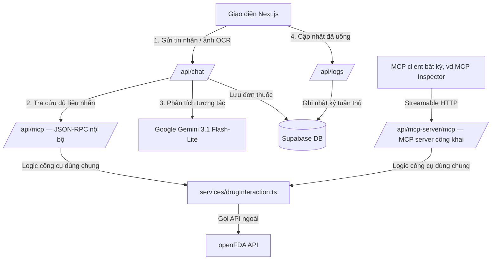
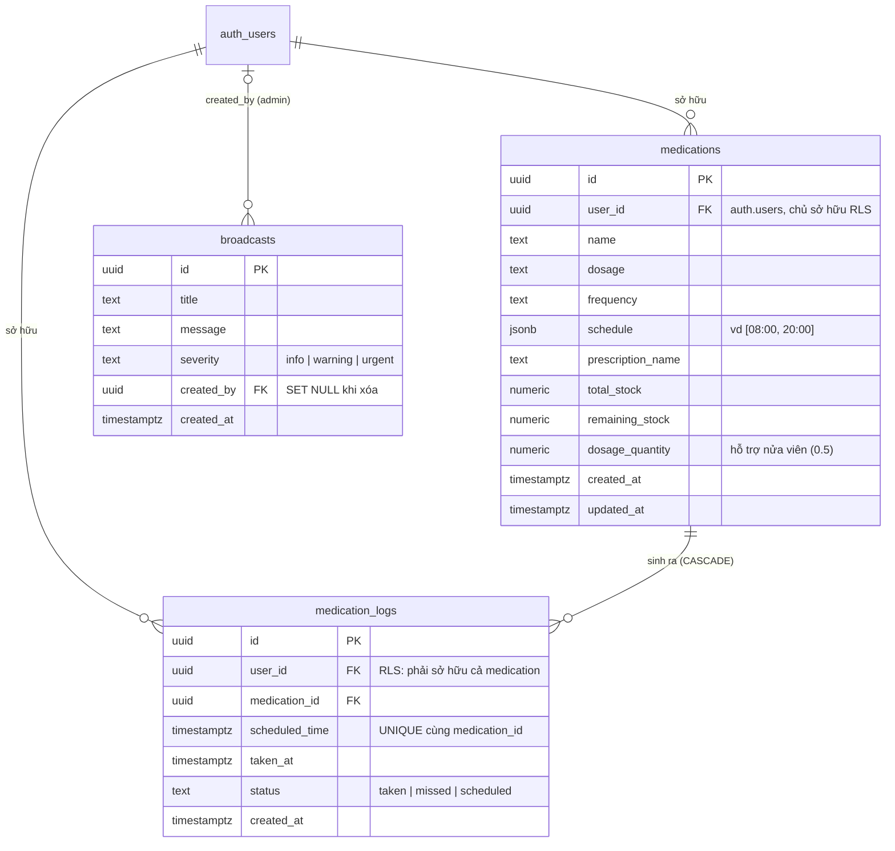

# 🏛️ Kiến trúc Hệ thống — MediMate AI

> 🇬🇧 English version: [architecture.md](architecture.md)

Tài liệu này mô tả kiến trúc phần mềm, mô hình dữ liệu, các luồng nghiệp vụ cốt lõi (luồng tiếp nhận/kiểm tra tương tác thuốc và tính toán tuân thủ) cùng cơ chế bảo mật dữ liệu y khoa của MediMate AI.

---

## 1. Tổng quan Kiến trúc

MediMate AI được xây dựng trên **Next.js App Router** kết hợp mô hình bảo mật cơ sở dữ liệu theo kiểu **Backend-as-a-Service (Supabase)**. Toàn bộ nghiệp vụ được đóng gói thành các serverless API route được bảo vệ bởi lớp middleware Supabase Auth.



---

## 2. Mô hình Dữ liệu (ERD)

Ba bảng được bảo vệ bằng RLS trong Supabase (PostgreSQL); DDL đầy đủ tại [`supabase/schema.sql`](supabase/schema.sql), lịch sử thay đổi trong `supabase/migrations/`:



Các cơ chế toàn vẹn dữ liệu ngoài cột:

- **Trigger trừ kho** — `handle_medication_log_status_change()` trừ `remaining_stock` theo `dosage_quantity` khi log chuyển sang `taken` (và cộng lại khi bỏ đánh dấu), chặn trong khoảng `[0, total_stock]`.
- **Chống race condition** — unique index `(medication_id, scheduled_time)` ngăn hai lượt tải trang đồng thời sinh trùng log trong ngày.
- **Đường ghi của broadcasts** — không có policy INSERT cho user; bản ghi chỉ được tạo qua admin API dùng service-role key.

---

## 3. Các Luồng Nghiệp vụ Cốt lõi

### A. Thêm Thuốc & Kiểm tra Tương tác (Intake & Safe Interaction Checker)

Khi người dùng gửi yêu cầu thêm thuốc mới (qua chat hoặc ảnh đơn thuốc):

1. **Intake Agent**: Gemini trích xuất các trường thông tin thuốc (`name`, `dosage`, `frequency`, `schedule`, `total_stock`, `dosage_quantity`).
2. **Lấy danh sách thuốc hiện tại**: Hệ thống tải các thuốc bệnh nhân đang dùng từ Supabase.
3. **Truy vấn MCP**:
   - Route `/api/chat` gọi POST nội bộ tới endpoint công cụ JSON-RPC `/api/mcp`.
   - Logic công cụ nằm ở `src/services/drugInteraction.ts` (dùng chung với MCP server công khai) và dùng `AbortSignal.timeout(8000)` để truy vấn dữ liệu tương tác từ API openFDA (Hoa Kỳ).
4. **Interaction Checker Agent**:
   - Nhận báo cáo nhãn thô từ endpoint công cụ.
   - Dùng Gemini phân tích cảnh báo tương tác chéo giữa thuốc mới và các thuốc hiện có.
   - Nếu phát hiện tương tác mức **High** hoặc **Medium**, hệ thống dừng lại và trả về phản hồi `WARNING_INTERACTION` kèm hướng dẫn. Bệnh nhân có thể hủy, hoặc chấp nhận rủi ro một cách tường minh để ghi lại lịch.

### B. Tính Chuỗi ngày Tuân thủ (Adherence Streak)

Tỷ lệ tuân thủ thực tế được tính tự động qua route `/api/stats` và phương thức `getComplianceStreak()`:

- Quét toàn bộ nhật ký uống thuốc trong 30 ngày gần nhất.
- Gom nhóm theo ngày (định dạng `YYYY-MM-DD`).
- Một ngày được tính là **ĐẠT** khi tỷ lệ lượt đã uống (trạng thái `taken`) trên tổng lượt phải uống trong ngày đạt **≥ 80%**.
- Chuỗi ngày đếm lùi từ hôm nay (hoặc từ hôm qua nếu hôm nay chưa tới giờ uống, hoặc ngày vẫn còn các lượt chờ khiến chưa thể kết luận).

---

### C. Công cụ Kiểm tra Tương tác — hai transport, một triển khai

Công cụ `check_drug_interaction` được triển khai một lần duy nhất tại `src/services/drugInteraction.ts` và mở ra qua hai transport:

| Transport | Route | Xác thực | Mục đích |
|---|---|---|---|
| JSON-RPC 2.0 nội bộ (`tools/list` / `tools/call`) | `/api/mcp` | Bắt buộc Supabase session cookie | Được pipeline chat gọi kèm ngữ cảnh xác thực của bệnh nhân |
| **MCP server công khai** (Model Context Protocol, Streamable HTTP qua `@modelcontextprotocol/sdk` + `mcp-handler`) | `/api/mcp-server/mcp` | Ẩn danh có chủ đích | Cho phép mọi MCP client (MCP Inspector, Claude Desktop, Gemini CLI…) gọi cùng công cụ |

Endpoint công khai an toàn khi để ẩn danh vì nó **không chạm tới dữ liệu bệnh nhân** — chỉ trung chuyển tài liệu nhãn thuốc công khai của openFDA — và vẫn áp cùng giới hạn chống DoS (≤ 10 thuốc mỗi lần, tên thuốc ≤ 100 ký tự) qua zod schema.

---

## 4. Chính sách Bảo mật Dữ liệu Y khoa (lấy cảm hứng từ HIPAA)

Để bảo vệ thông tin y khoa cá nhân, MediMate AI áp dụng các biện pháp:

1. **Row Level Security (RLS) ở mức cơ sở dữ liệu**:
   - Bảng `medications` chỉ cho phép chủ sở hữu (`auth.uid() = user_id`) thao tác CRUD.
   - Bảng `medication_logs` dùng chính sách RLS `INSERT` thắt chặt, ngăn việc gán chéo log vào thuốc của người khác:
     ```sql
     WITH CHECK (
         auth.uid() = user_id
         AND EXISTS (
             SELECT 1 FROM public.medications
             WHERE id = medication_id AND user_id = auth.uid()
         )
     )
     ```
2. **Bảo vệ các endpoint công cụ**:
   - `/api/mcp` (transport nội bộ của pipeline agent) yêu cầu người dùng đã xác thực qua Supabase Auth session cookie được chuyển tiếp từ `/api/chat`. Chặn hoàn toàn truy cập ẩn danh.
   - `/api/mcp-server/mcp` (MCP server công khai) ẩn danh có chủ đích nhưng chỉ phục vụ **dữ liệu openFDA công khai** — không bao giờ là dữ liệu bệnh nhân — kèm giới hạn DoS ép buộc qua schema.
3. **Không rò rỉ PHI**:
   - Dữ liệu y khoa của bệnh nhân không bao giờ được ghi ra console log máy chủ (không `console.log` dữ liệu đơn thuốc hay chi tiết nhật ký uống).

---

## 5. Phân hệ Quản trị (Admin Panel & RBAC)

Kiểm soát truy cập dựa trên **allowlist email** cấu hình qua biến môi trường `ADMIN_EMAILS`, kiểm tra hoàn toàn phía máy chủ (không thể giả mạo từ client).

- **Admin API (`/api/admin/users`)**: Khởi tạo Supabase client với `SUPABASE_SERVICE_ROLE_KEY` để bỏ qua RLS, thu thập thống kê toàn hệ thống và liệt kê người dùng kèm chuỗi ngày tuân thủ thực tế.
- **Trạng thái trống trung thực**: Nếu máy chủ không có `SUPABASE_SERVICE_ROLE_KEY`, API trả về trạng thái trống kèm hướng dẫn cấu hình — hệ thống **không** tạo dữ liệu bệnh nhân giả để tránh gây hiểu nhầm cho giám khảo.
